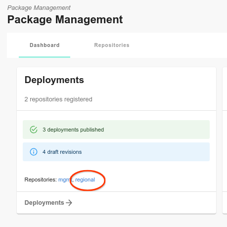
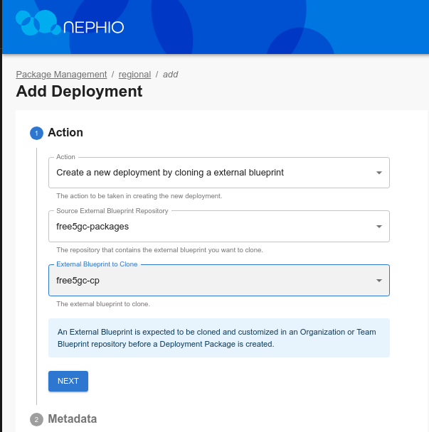

# Quick Start for GCE

1. Create a VM:

   ```bash
   $ gcloud compute instances create --machine-type e2-standard-8 \
                                     --boot-disk-size 200GB \
                                     --image-family=ubuntu-2004-lts \
                                     --image-project=ubuntu-os-cloud \
                                     --metadata=startup-script-url=https://raw.githubusercontent.com/nephio-project/test-infra/main/e2e/provision/gce_init.sh \
                                     nephio-r1-e2e
   ```

   There are some optional metadata values you can pass (add them as
   comma-delimited key=value pairs in the `--metadata` flag).

   - `nephio-run-e2e` defaults to `false` but you can set it to `true` to run
     the full e2e suite, instead of just setting up the sandbox.
   - `nephio-setup-type` defaults to `r1` but `one-summit` will use the workshop
     code instead of the R1 code. Results are not guaranteed with that.
   - `nephio-setup-debug` defaults to `false` but `true` will turn on verbose
     debugging.
   - `nephio-test-infra-repo` defaults to
     `https://github.com/nephio-project/test-infra.git` but you can set it to
     your repository when testing changes to these scripts, and your repo will
     then be pulled by the `gce_init.sh` instead.
   - `nephio-test-infra-branch` defaults to `main` but you can use it along with
     the repo value to choose a branch in the repo for testing.

2. If you want to watch the progress of the installation, give it about 30
   seconds to reach a network accessible state, and then ssh in and tail the
   startup script exection:

   Googlers (you also need to run `gcert`):
   ```bash
   $ gcloud compute ssh ubuntu@nephio-r1-e2e -- \
                    -o ProxyCommand='corp-ssh-helper %h %p' \
                    sudo journalctl -u google-startup-scripts.service --follow
   ```

   Everyone else:
   ```bash
   $ gcloud compute ssh ubuntu@nephio-r1-e2e -- \
                    sudo journalctl -u google-startup-scripts.service --follow
   ```

4. Once it's done, ssh in and port forward the port to the UI (7007) and to
   Gitea's HTTP interface, if you want to have that (3000):

   Googlers (you also need to run `gcert`):
   ```bash
   $ gcloud compute ssh ubuntu@nephio-r1-e2e -- \
                    -o ProxyCommand='corp-ssh-helper %h %p' \
                    -L 7007:localhost:7007 \
                    -L 3000:172.18.0.200:3000 \
                    kubectl port-forward --namespace=nephio-webui svc/nephio-webui 7007
   ```

   Everyone else:
   ```bash
   $ gcloud compute ssh ubuntu@nephio-r1-e2e -- \
                    -L 7007:localhost:7007 \
                    -L 3000:172.18.0.200:3000 \
                    kubectl port-forward --namespace=nephio-webui svc/nephio-webui 7007
   ```

   You can now navigate to
   [http://localhost:7007/config-as-data](http://localhost:7007/config-as-data) to
   browse the UI.

5. You probably want a second ssh window open to run `kubectl` commands, etc.,
without the port forwarding (which would fail if you try to open a second ssh
connection with that setting).

   Googlers:
   ```bash
   $ gcloud compute ssh ubuntu@nephio-r1-e2e -- -o ProxyCommand='corp-ssh-helper %h %p'
   ```

   Everyone else:
   ```bash
   $ gcloud compute ssh ubuntu@nephio-r1-e2e
   ```

6. From that session, you can deploy a fleet of four edge clusters with this:

   ```
   $ cat > edge-clusters.yaml <<EOF
   apiVersion: config.porch.kpt.dev/v1alpha2
   kind: PackageVariantSet
   metadata:
     name: edge-clusters
   spec:
     upstream:
       repo: nephio-example-packages
       package: nephio-workload-cluster
       revision: v5
     targets:
     - repositories:
       - name: mgmt
         packageNames:
         - edge01
         - edge02
         - edge03
         - edge04
       template:
         annotations:
           approval.nephio.org/policy: initial
         pipeline:
           mutators:
           - image: gcr.io/kpt-fn/set-labels:v0.2.0
             configMap:
               nephio.org/site-type: edge
   EOF
   $ kubectl apply -f edge-clusters.yaml
   ```

   You can observe the progress by looking at the UI, or by using `kubectl` to
   monitor the various package variants, package revisions, and kind clusters
   that get created.

7. Once a kind cluster comes up, you can access it by getting its kubeconfig
   from the cluster. For example:

   ```
   $ kubectl get clusters
   NAME       PHASE         AGE     VERSION
   edge01     Provisioned   3h40m   v1.26.3
   edge02     Provisioned   3h42m   v1.26.3
   edge03     Provisioned   3h42m   v1.26.3
   edge04     Provisioned   3h40m   v1.26.3
   $ kubectl get secret edge01-kubeconfig -o jsonpath='{.data.value}' | base64 -d > edge01-kubeconfig
   $ kubectl --kubeconfig edge01-kubeconfig get ns
   NAME                           STATUS   AGE
   config-management-monitoring   Active   3h35m
   config-management-system       Active   3h35m
   default                        Active   3h39m
   kube-node-lease                Active   3h39m
   kube-public                    Active   3h39m
   kube-system                    Active   3h39m
   $
   ```

   You should also check that the Kind cluster came up fully with `kubectl get
   machinesets`. Sometimes they do not all come up; it's not clear why yet, but
   is probably a resourcing issue on the VM. For example, in this case only
   two clusters had machines come up:

   ```
   $ kubectl get machinesets
   NAME                                   CLUSTER    REPLICAS   READY   AVAILABLE   AGE     VERSION
   edge01-md-0-6fk8w-9dc5bb56dxnpz69      edge01     3                              3h46m   v1.26.3
   edge02-md-0-blqfh-57fc564884xjf865     edge02     3          3       3           3h49m   v1.26.3
   edge03-md-0-8bss6-5b95ddf7b8xf8fg5     edge03     3          3       3           3h48m   v1.26.3
   edge04-md-0-z7b8p-77748bffbfxwsjbc     edge04     3                              3h46m   v1.26.3
   ```

   If that's the case, pull out the kubeconfig for one of the clusters with
   READY machines. In this case, edge02 is fully functional, so we will use that
   in the following steps.

8. Next, install the free5gc functions that are not managed by the
   operator. For now, let's just pick one cluster, say edge02, to run those. We
   should consider if we want to create a "regional" cluster for these, or what
   the overall topology should look like. Since these are all installed with a
   single package, we can use the UI to pick the `free5gc-cp` package from the
   `free5gc-packages` repository, and clone it to the `edge02` repository.

   

   

   

   Click through the "Next" button until you are through all the steps, then
   click "Add Deployment". On the next screen, click "Propose", and then
   "Approve". Shortly thereafter, we should it in the cluster:

   ```
   $ kubectl --kubeconfig edge02-kubeconfig get ns
   NAME                           STATUS   AGE
   config-management-monitoring   Active   4h8m
   config-management-system       Active   4h8m
   default                        Active   4h8m
   free5gc-cp                     Active   7s
   kube-node-lease                Active   4h8m
   kube-public                    Active   4h8m
   kube-system                    Active   4h8m
   resource-group-system          Active   4h7m
   $
   $ kubectl --kubeconfig edge02-kubeconfig -n free5gc-cp get all
   NAME                                 READY   STATUS     RESTARTS   AGE
   pod/free5gc-ausf-7d494d668d-nswlf    0/1     Init:0/1   0          18s
   pod/free5gc-nrf-66cc98cfc5-8scpn     0/1     Init:0/1   0          18s
   pod/free5gc-nssf-668db85d54-jhqlc    0/1     Init:0/1   0          18s
   pod/free5gc-pcf-55d4bfd648-584tp     0/1     Init:0/1   0          18s
   pod/free5gc-udm-845db6c9c8-jmwrl     0/1     Init:0/1   0          18s
   pod/free5gc-udr-79466f7f86-mw6bz     0/1     Init:0/1   0          17s
   pod/free5gc-webui-84ff8c456c-bkvhm   0/1     Init:0/1   0          17s
   pod/mongodb-0                        0/1     Pending    0          17s

   NAME                    TYPE        CLUSTER-IP       EXTERNAL-IP   PORT(S)          AGE
   service/ausf-nausf      ClusterIP   10.134.77.186    <none>        80/TCP           18s
   service/mongodb         ClusterIP   10.141.173.153   <none>        27017/TCP        18s
   service/nrf-nnrf        ClusterIP   10.130.158.206   <none>        8000/TCP         18s
   service/nssf-nnssf      ClusterIP   10.128.206.40    <none>        80/TCP           18s
   service/pcf-npcf        ClusterIP   10.130.21.1      <none>        80/TCP           18s
   service/udm-nudm        ClusterIP   10.136.45.206    <none>        80/TCP           18s
   service/udr-nudr        ClusterIP   10.134.52.158    <none>        80/TCP           18s
   service/webui-service   NodePort    10.136.16.33     <none>        5000:30500/TCP   18s

   NAME                            READY   UP-TO-DATE   AVAILABLE   AGE
   deployment.apps/free5gc-ausf    0/1     1            0           18s
   deployment.apps/free5gc-nrf     0/1     1            0           18s
   deployment.apps/free5gc-nssf    0/1     1            0           18s
   deployment.apps/free5gc-pcf     0/1     1            0           18s
   deployment.apps/free5gc-udm     0/1     1            0           18s
   deployment.apps/free5gc-udr     0/1     1            0           18s
   deployment.apps/free5gc-webui   0/1     1            0           17s

   NAME                                       DESIRED   CURRENT   READY   AGE
   replicaset.apps/free5gc-ausf-7d494d668d    1         1         0       18s
   replicaset.apps/free5gc-nrf-66cc98cfc5     1         1         0       18s
   replicaset.apps/free5gc-nssf-668db85d54    1         1         0       18s
   replicaset.apps/free5gc-pcf-55d4bfd648     1         1         0       18s
   replicaset.apps/free5gc-udm-845db6c9c8     1         1         0       18s
   replicaset.apps/free5gc-udr-79466f7f86     1         1         0       18s
   replicaset.apps/free5gc-webui-84ff8c456c   1         1         0       17s

   NAME                       READY   AGE
   statefulset.apps/mongodb   0/1     17s
   ```

9. Now we need to deploy the free5gc operator across all of the edge clusters.
   To do this, we use another PackageVariantSet. This one uses an
   objectSelector, and selects the WorkloadCluster resources that were added to
   the management cluster by the edge-clusters PackageVariantSet. We select only
   those clusters with the `edge` label.

   ```
   apiVersion: config.porch.kpt.dev/v1alpha2
   kind: PackageVariantSet
   metadata:
     name: edge-free5gc-operator
   spec:
     upstream:
       repo: free5gc-packages
       package: free5gc-operator
       revision: v2
     targets:
     - objectSelector:
         apiVersion: infra.nephio.org/v1alpha1
         kind: WorkloadCluster
         matchLabels:
           nephio.org/site-type: edge
       template:
         annotations:
           approval.nephio.org/policy: initial
   ```

10. Within a few minutes of applying that, you should see `free5gc` namespaces on
    your edge clusters:

    ```
    $ kubectl --kubeconfig edge02-kubeconfig get ns
    NAME                           STATUS   AGE
    config-management-monitoring   Active   3h46m
    config-management-system       Active   3h46m
    default                        Active   3h47m
    free5gc                        Active   159m
    free5gc-cp                     Active   3h1m
    kube-node-lease                Active   3h47m
    kube-public                    Active   3h47m
    kube-system                    Active   3h47m
    resource-group-system          Active   3h45m
    $
    $ kubectl --kubeconfig edge02-kubeconfig -n free5gc get all
    NAME                                                          READY   STATUS    RESTARTS   AGE
    pod/free5gc-operator-controller-controller-58df9975f4-sglj6   2/2     Running   0          164m

    NAME                                                     READY   UP-TO-DATE   AVAILABLE   AGE
    deployment.apps/free5gc-operator-controller-controller   1/1     1            1           164m

    NAME                                                                DESIRED   CURRENT   READY   AGE
    replicaset.apps/free5gc-operator-controller-controller-58df9975f4   1         1         1       164m
    ```

11. Finally, we can deploy individual network functions which the operator will
    instantiate. For now, we will use a separate PackageVariantSet for each of
    AMF, SMF, and UPF. In the future, we could put those PackageVariantSets into
    a "topology" package and deploy them all as a unit. Or we can use a topology
    controller to create them. But for now, let's do each manually. Here's an
    example PVS for the UPF, the others are similar:

    ```
    apiVersion: config.porch.kpt.dev/v1alpha2
    kind: PackageVariantSet
    metadata:
      name: edge-free5gc-upf
    spec:
      upstream:
        repo: free5gc-packages
        package: free5gc-upf
        revision: v1
      targets:
      - objectSelector:
          apiVersion: infra.nephio.org/v1alpha1
          kind: WorkloadCluster
          matchLabels:
            nephio.org/site-type: edge
        template:
          annotations:
            approval.nephio.org/policy: initial
    ```
